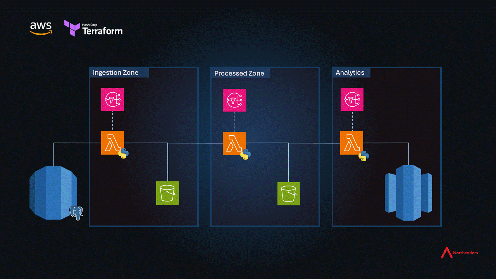
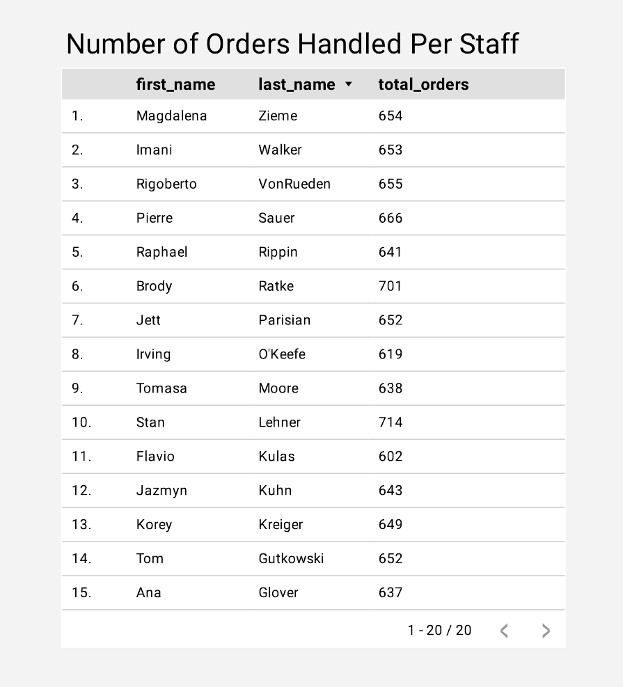
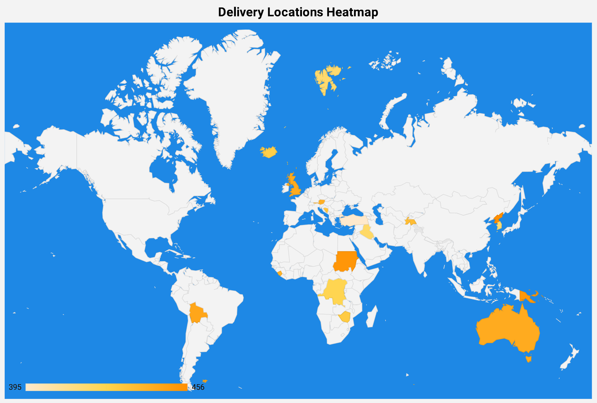

# Team Fenor Data Engineering Project - ToteSys ETL Pipeline

## Overview

This project is an ETL (Extract, Transform, Load) pipeline that automates data movement from a live PostgreSQL relational database (ToteSys) into a data warehouse optimised for analytics. The pipeline is designed for scalability, reliability and automation using AWS services and Infrastructure as Code.

This project has been an opportunity for our team to showcase our knowledge of Python, SQL, database modelling, AWS, good DevOps practices and Agile working, amongst other technical and non-technical skills learnt over our time on the Northcoders Data Engineering Bootcamp.


## About

The application of this project can be split into three separate stages: Extract, Transform and Load, or, as shown in the diagram below, the ingestion zone, the processed zone, and the analytics zone.



The ToteSys database is meant to simulate the back-end data of a commercial application, with data being inserted and updated into the database several times a day. The full ERD for the ToteSys database is detailed [here](https://dbdiagram.io/d/SampleDB-6332fecf7b3d2034ffcaaa92). 

### Ingestion Zone

The ingestion zone of the pipeline utilises Python and AWS Lambda to extract data at regular intervals from the ToteSys database. The timing of this extraction is managed using Amazon Eventbridge, and the entire process is logged to Cloudwatch, with any failures triggering an email alert. This stage uses Python, SQL and PG8000 to connect to the database, extract the relevant data, and do some minimal processing before storage.

The data is stored in JSONL (JSON Lines) format in an "ingestion" Amazon S3 bucket. The data is immutable and will not be changed or destroyed.

### Processed Zone

The processed zone of the pipeline remodels the data into a predefined schema suitable for data warehousing, and stores the data in Parquet format in a "processed" S3 bucket. The data stored in the "processed" bucket is also immutable.

This stage uses Python and Pandas to transform the data stored in the "ingestion" bucket, and is triggered automatically when it detects the completion of a data ingestion job. This transformation includes populating the dimension and fact tables of a single "star" schema in the final data warehouse. The process is again logged and monitored using Cloudwatch.

### Analytics Zone

The analytics zone of the pipeline loads the transformed data from the "processed" bucket into a prepared data warehouse at defined intervals. The process is again logged and monitored using Cloudwatch. The data is now ready to be examined using your BI dashboard of choice.

The following table lists the fact and dimension tables included in the single star-schema stored in the data warehouse, and the full ERD for the data warehouse is detailed [here](https://dbdiagram.io/d/SampleDW-Sales-637a423fc9abfc611173f637).

| tablename        |
|------------------|
| fact_sales_order |
| dim_staff        |
| dim_location     |
| dim_design       |
| dim_date         |
| dim_currency     |
| dim_counterparty |

The following table and heat map shows some examples of the kind of business intelligence that can be gained from querying the populated data warehouse.






## Prerequisites

Before setting up and running the ETL pipeline, ensure you have the following installed and configured:

- Python 3.13 (recommended latest stable version)

    Check if Python is installed: 
```bash
  python --version
```

If not installed, download it from [python.org](https://www.python.org/downloads/).

- pip (Python package manager)

    Check if pip is installed: 
```bash
  pip --version
```

If missing, install it:
```bash
  python -m ensurepip --default-pip
```

- AWS CLI (for interacting with AWS services):

  Check installation:
```bash
  aws --version
```

If missing, install from [AWS CLI docs](https://aws.amazon.com/cli/).

- AWS credentials (IAM user with necessary permissions):

  Configure credentials using:
```bash
  aws configure
```

- Terraform (for Infrastructure as Code):

  Check installation:
```bash
  terraform --version
```

If missing, install from [Terraform docs](https://developer.hashicorp.com/terraform/install).


## Run Locally

Fork the repo from https://github.com/TorSatherley/team-fenor-de-project

Clone the project:

```bash
  git clone https://github.com/TorSatherley/team-fenor-de-project
```

Go to the project directory:

```bash
  cd team-fenor-de-project
```

Create a new Virtual Environment (recommended):

```bash
  python -m venv venv
```

Activate venv:
```bash
  source venv/bin/activate  # On Linux/macOS
  venv\Scripts\activate  # On Windows
```

Install dependencies

```bash
  pip install -r requirements.txt
```

You can now utilise the Makefile to automate several processes. In the command line run:

```bash
  make run-checks
```
to automate the processes of using:
 - bandit to check for common security issues in Python
 - pip-audit to audit the Python environment for packages with known vulnerabilities
 - black to check for Python PEP 8 compliance
 - pytest to check all unit-tests are running and passing
 - pytest coverage to ensure the test coverage over all Python files exceeds 90%

### Deployment

The ETL pipeline infrastructure is managed using Terraform. Follow these steps to deploy the project onto your own AWS account:

1. Before running any Terraform commands, navigate to the Terraform folder in the project directory and initialise Terraform:
```bash
  cd terraform
  terraform init
```
This downloads the necessary provider plugins and sets up Terraform for use.

2. Preview the Infrastructure changes:
```bash
  terraform plan
```
This command will output a summary of what resources will be added, changed, or destroyed without actually making any modifications.

3. Apply the changes:
```bash
  terraform apply
```
This will deploy the infrastructure. Terraform will show a summary of the planned changes and ask for confirmation. Type yes when prompted to proceed. Check on your AWS console that the correct AWS services have been deployed correctly.

4. Destroy the infrastructure (optional):
```bash
  terraform destroy
```
Once you've finished checking out the services deployed on your AWS console, you might want to tear the infrastructure down. Not doing so could cause unwanted costs to your AWS account. You'll be able to deploy the project again using the Terraform Infrastructure as Code anytime you want.

## CI/CD

This project has been designed to be maintained using continuous integration and continuous deployment - specifically using GitHub actions. This enables seamless updates of the project into the production environment, and runs all of the same checks as the 'make run-checks' command, as well as deploying all changes via Terraform. The workflow has been designed so that any Terraform deployment will not happen until all checks have been completed successfully.

To test this, make a branch of your forked version of the repo, make a change and then merge it with main. Check the "Actions" tab on this repo on your GitHub account to see all unit tests, compliance checks and Terraform deployment happen automatically within the workflow.

## Roadmap

Some future additions to extend the project could include:

- Populate all of the fact and dim tables in the overall data warehouse structure shown [here](https://dbdiagram.io/d/RevisedDW-63a19c5399cb1f3b55a27eca).
- Ingest data from an external API - for example retrieving relevant daily foreign exchange rates from https://github.com/fawazahmed0/exchange-api, and store in the "ingestion" S3 bucket.
- Ingest data from a file source - eg another S3 bucket that can be collected and stored at intervals.

## Documentation

The original specification for this project can be found at https://github.com/northcoders/de-project-specification.

## Contributors

Alphabetically listed:

- Brendan Corbett [GitHub](https://github.com/BrendanC8450)
- Connor Creed [GitHub](https://github.com/creedy293) | [LinkedIn](https://www.linkedin.com/in/c-creed-942132231/)
- Fabio Greenwood [GitHub](https://github.com/FabioGreenwood) | [LinkedIn](https://www.linkedin.com/in/fabio-greenwood-b0832676/)
- Tor Satherley [GitHub](https://github.com/TorSatherley) | [LinkedIn](https://www.linkedin.com/in/tor-satherley-95a789265/)
- Vincent Toor-Azorin [Github](https://github.com/Armatoor147) | [LinkedIn](https://www.linkedin.com/in/vincent-toor-azorin/)